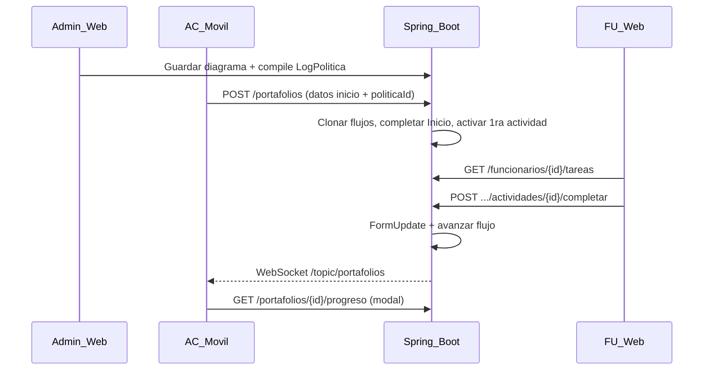

# Flujo de Trámite End-to-End

Documentación del flujo **Política de Negocio → Trámite (AC) → Formulario (FU) → Progreso en tiempo real (AC móvil)**.

## Qué existía antes

- **LogPolitica**: compilaba y versionaba el **diseño** del diagrama (validación Inicio→Fin). No registraba ejecución de trámites.
- **PortafolioService.create**: clonaba flujos plantilla; arrancaba por `orden==1` (incorrecto respecto al nodo Inicio).
- **Avance del flujo**: lo hacía el **cliente Flutter** con `PUT /flujos/{id}` sin evaluar decisión/pregunta.
- **WebSocket**: solo colaboración en el editor de diagramas (`/ws-diagram`).
- **Frontend Angular**: sin módulo para que el funcionario llene formularios pendientes.
- **Móvil Flutter**: tarjetas de trámite sin modal de detalle; funcionario completaba actividades desde el móvil.

## Qué se modificó

### Backend (`politica-negocio`)

| Componente | Cambio |
|------------|--------|
| `TramiteEngineService` | Motor SSOT: completar actividad, avanzar flujo, guardar `FormUpdate`, emitir WebSocket |
| `PortafolioService.create` | Valida `LogPolitica` funcional; arranca desde nodo **Inicio** |
| `PortafolioController` | `GET /{id}`, `GET /{id}/progreso`, `POST /{id}/actividades/{actividadId}/completar` |
| `FuncionarioTareaController` | `GET /api/funcionarios/{userId}/tareas` |
| `FormUpdateRepository` | `findByPortafolioId`, `findByPortafolioIdAndActividadId` |
| `WebSocketConfig` | Endpoint STOMP nativo `/ws-native` para Flutter |
| `SecurityConfig` | `/ws-native/**` público |

### Frontend Angular (`politica-negocio-frontend`)

| Componente | Cambio |
|------------|--------|
| `features/tareas/` | Módulo **Tareas** para FUNCIONARIO: lista pendientes + llenar formulario |
| `core/services/tarea.service.ts` | Cliente HTTP tareas y completar |
| `app.routes.ts` | Ruta `/tareas` protegida por rol FUNCIONARIO |
| `app-layout` | Enlace nav "Tareas" para funcionarios |
| `dashboard.component.ts` | Corregido rol `ATENCION_CLIENTE`; tarjeta Tareas para FU |

### Móvil Flutter (`politica_negocio_movil`)

| Componente | Cambio |
|------------|--------|
| `TramiteSocketService` | STOMP a `/ws-native`, suscripción `/topic/portafolios` y `/topic/portafolio/{id}` |
| `tramite_progreso_modal.dart` | Modal de progreso al tocar un trámite |
| `tramite_card.dart` | Clickeable con `onTap` |
| `tramites_screen.dart` | WebSocket en vivo + validación datos de inicio |
| `actividades_screen.dart` | Solo lectura (completar desde web) |
| `pubspec.yaml` | Dependencia `stomp_dart_client` |

## Qué hace ahora el flujo

1. **Admin** diseña política en workflow-editor y guarda (compila LogPolitica válido).
2. **AC (móvil)** crea trámite con datos de inicio; backend arranca en nodo Inicio.
3. **FU (web `/tareas`)** ve tareas de su departamento, llena formulario y guarda.
4. **Backend** avanza el flujo, persiste `FormUpdate` y emite evento WebSocket.
5. **AC (móvil)** recibe actualización en lista y puede abrir modal de progreso detallado.

## Endpoints clave

| Método | Ruta | Uso |
|--------|------|-----|
| POST | `/api/portafolios` | Crear trámite |
| GET | `/api/portafolios/{id}/progreso` | Progreso derivado (Flujo + FormUpdate) |
| POST | `/api/portafolios/{pid}/actividades/{aid}/completar` | FU completa actividad |
| GET | `/api/funcionarios/{userId}/tareas` | Bandeja FU |
| WS | `/ws-native` → `/topic/portafolios` | Lista trámites (push) |
| WS | `/topic/portafolio/{id}` | Detalle progreso (push) |

## Notas

- **LogPolitica** sigue siendo snapshot de diseño, no historial de ejecución.
- Progreso del trámite = instancias `Flujo.estadoActual` + `FormUpdate` por portafolio.
- Decisión/pregunta/espera: resolución pragmática (label Sí/No, checkbox iteración, pass-through en espera).
- Funcionario opera desde **web**; móvil FU es solo consulta.
