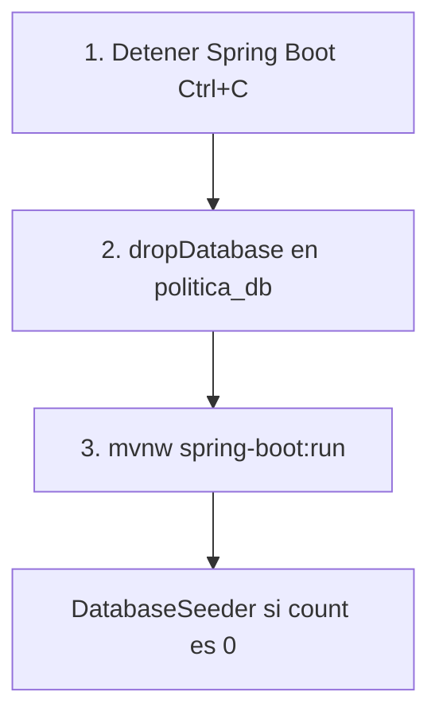

# MongoDB local (sin Docker)

Guía operativa para desarrollar con **MongoDB Community** instalado nativamente en Windows, conectado al backend Spring Boot de este proyecto.

## Índice rápido

- [Reset tipo `migrate:fresh` (Laravel)](#reset-tipo-migratefresh-equivalente-a-laravel) — borrar todo y volver al seed
- [Instalación en Windows](#instalación-local-en-windows)
- [Ver contenido (Compass / mongosh)](#ver-contenido-de-la-base-de-datos)
- [Datos iniciales (seed)](#datos-iniciales-seed)
- [Troubleshooting](#troubleshooting)

## Requisitos y conexión con el backend


| Componente    | Valor                                   |
| ------------- | --------------------------------------- |
| Java          | 17                                      |
| MongoDB       | Puerto `27017`                          |
| Spring Boot   | Puerto `8081`                           |
| Base de datos | `politica_db`                           |
| URI Spring    | `mongodb://localhost:27017/politica_db` |


La configuración ya está definida en `src/main/resources/application.properties`:

```properties
spring.data.mongodb.uri=mongodb://localhost:27017/politica_db
spring.data.mongodb.auto-index-creation=true
server.port=8081
```

No necesitas cambiar nada para el uso local estándar. Solo asegúrate de que MongoDB esté corriendo antes de levantar la aplicación.

### Arrancar el backend

Desde la carpeta `politica-negocio/`:

```powershell
.\mvnw.cmd spring-boot:run
```

Al iniciar por primera vez (o tras un reset completo), `DatabaseSeeder` inserta datos iniciales si las colecciones están vacías. En los logs deberías ver algo como:

```
Base de datos poblada exitosamente con usuarios y asignaciones por defecto.
```

---

## Instalación local en Windows

### 1. Descargar e instalar

1. Descarga **MongoDB Community Server** (.msi):
  [https://www.mongodb.com/try/download/community](https://www.mongodb.com/try/download/community)  
   Selecciona: **Windows**, instalador **msi**.
2. Ejecuta el instalador y marca:
  - **Install MongoDB as a Service** (nombre típico del servicio: `MongoDB` o `MongoDB Server`)
  - Opcional: **Install MongoDB Compass** (interfaz gráfica para explorar datos)
3. Finaliza la instalación. MongoDB quedará registrado como servicio de Windows y se iniciará automáticamente.

### 2. Verificar que MongoDB está corriendo

**Administrador de servicios:**

1. `Win + R` → escribe `services.msc` → Enter
2. Busca **MongoDB Server** (o **MongoDB**)
3. Estado debe ser **En ejecución**

**PowerShell / CMD:**

```powershell
net start MongoDB
```

Si ya está activo, verás: `The requested service has already been started.`

**Probar conexión con mongosh:**

```powershell
mongosh mongodb://localhost:27017
```

Deberías ver el prompt `test>` o similar.

### 3. Si `mongosh` no se reconoce

En instalaciones recientes (p. ej. **MongoDB Server 8.x**), el MSI suele instalar solo `mongod.exe` en `bin`, **sin** `mongosh.exe`. El servidor puede estar corriendo y aun así fallar el comando `mongosh`.

Comprueba qué hay en tu carpeta `bin`:

```powershell
dir "C:\Program Files\MongoDB\Server\*\bin\mongosh.exe"
```

Si no aparece el archivo, instala **MongoDB Shell** por separado.

#### Opción A — winget (recomendada en Windows)

```powershell
winget install MongoDB.Shell
```

Cierra y vuelve a abrir PowerShell, luego:

```powershell
mongosh mongodb://localhost:27017
```

#### Opción B — Instalador MSI

1. Descarga **MongoDB Shell**: [https://www.mongodb.com/try/download/shell](https://www.mongodb.com/try/download/shell)
2. Instala el `.msi` (marca agregar al PATH si el asistente lo ofrece).
3. Reinicia la terminal y ejecuta `mongosh mongodb://localhost:27017`.

#### Opción C — Sin CLI: MongoDB Compass

Si solo quieres ver datos sin instalar `mongosh`:

```powershell
& "C:\Program Files\MongoDB\Server\8.3\bin\InstallCompass.ps1"
```

(Ajusta `8.3` a tu versión.) Luego conecta Compass a `mongodb://localhost:27017`.

#### Si `mongosh` sí está instalado pero no en PATH

Ruta típica tras instalar el Shell:

```
C:\Program Files\mongosh\mongosh.exe
```

Invocar con ruta completa:

```powershell
& "C:\Program Files\mongosh\mongosh.exe" mongodb://localhost:27017
```

O agrega esa carpeta `bin` al **PATH** del sistema y reinicia PowerShell.

### 4. Comandos útiles del servicio

```powershell
# Iniciar
net start MongoDB

# Detener
net stop MongoDB
```

---

## URI, base de datos y rutas físicas


| Uso                        | Cadena / ubicación                                                |
| -------------------------- | ----------------------------------------------------------------- |
| Spring Boot                | `mongodb://localhost:27017/politica_db`                           |
| Compass / mongosh          | `mongodb://localhost:27017` → luego `use politica_db`             |
| Host / puerto              | `localhost:27017`                                                 |
| Configuración del servidor | `C:\Program Files\MongoDB\Server\<versión>\bin\mongod.cfg`        |
| Datos en disco             | Valor de `storage.dbPath` en `mongod.cfg` (típico: `...\data\db`) |


## Colecciones del proyecto

Spring Data MongoDB crea las colecciones al guardar documentos. Las definidas en el código son:


| Colección          | Entidad         |
| ------------------ | --------------- |
| `usuarios`         | Usuario         |
| `departamentos`    | Departamento    |
| `funcionariosDepa` | FuncionarioDepa |
| `politicasNegocio` | PoliticaNegocio |
| `portafolios`      | Portafolio      |
| `flujos`           | Flujo           |
| `actividades`      | Actividad       |
| `formularios`      | Formulario      |
| `formUpdates`      | FormUpdate      |
| `logDiagramas`     | LogDiagrama     |
| `adminDiagramas`   | AdminDiagrama   |


---

## Datos iniciales (seed)

El seeder (`DatabaseSeeder.java`) solo inserta datos si las colecciones están vacías:

- Si `departamentos.count() == 0` → crea 3 departamentos.
- Si `usuarios.count() == 0` → crea usuarios y asignaciones.

### Credenciales por defecto


| Rol           | Correo                     | Contraseña |
| ------------- | -------------------------- | ---------- |
| Administrador | `admin@example.com`        | `admin123` |
| Funcionario 1 | `funcionario1@example.com` | `password` |
| Funcionario 2 | `funcionario2@example.com` | `password` |
| Atención 1    | `atencion1@example.com`    | `password` |
| Atención 2    | `atencion2@example.com`    | `password` |


Las contraseñas se guardan hasheadas con BCrypt; en Compass o mongosh verás valores como `$2a$10$...`, no el texto plano.

---

## Ver contenido de la base de datos

### Opción A — MongoDB Compass (recomendada)

1. Abre **MongoDB Compass**.
2. **New Connection** → URI: `mongodb://localhost:27017` → **Connect**.
3. En el panel izquierdo, expande `**politica_db`**.
4. Haz clic en una colección (ej. `usuarios`) → pestaña **Documents**.

Descarga Compass: [https://www.mongodb.com/try/download/compass](https://www.mongodb.com/try/download/compass)

### Opción B — mongosh (CLI)

```javascript
mongosh mongodb://localhost:27017

// Listar bases de datos
show dbs

// Seleccionar la BD del proyecto
use politica_db

// Listar colecciones
show collections

// Ver usuarios
db.usuarios.find().pretty()

// Ver departamentos
db.departamentos.find().pretty()

// Ver políticas de negocio
db.politicasNegocio.find().pretty()

// Contar documentos
db.usuarios.countDocuments()
db.departamentos.countDocuments()

// Salir
exit
```

---

## Reset tipo `migrate:fresh` (equivalente a Laravel)

En Laravel, esto hace todo en un solo comando:

```bash
php artisan migrate:fresh --seed
```


| Paso en Laravel | Qué hace                                 | Equivalente en este proyecto                                                      |
| --------------- | ---------------------------------------- | --------------------------------------------------------------------------------- |
| `migrate:fresh` | Borra tablas y vuelve a crear el esquema | `db.dropDatabase()` en `politica_db` (Mongo no usa migraciones SQL)               |
| `--seed`        | Inserta datos iniciales                  | `DatabaseSeeder.java` al arrancar Spring Boot **si las colecciones están vacías** |


**Importante:** aquí **no existe** un comando tipo `php artisan`. El “fresh + seed” son **dos pasos manuales**: (1) vaciar la BD, (2) reiniciar la app.




### Receta rápida (copiar y pegar)

**Paso 1 — Detén el backend** (terminal donde corre Spring):

`Ctrl + C`

**Paso 2 — Borra la base del proyecto** (elige **A** o **B**):

#### A) Con mongosh (CLI)

```powershell
mongosh mongodb://localhost:27017
```

Dentro de mongosh:

```javascript
use politica_db
db.dropDatabase()
// Debe responder: { ok: 1, dropped: 'politica_db' }
exit
```

#### B) Con MongoDB Compass (sin mongosh)

1. Conecta a `mongodb://localhost:27017`
2. Clic derecho en **politica_db**  **Drop Database**→ → confirmar

**Paso 3 — Vuelve a levantar Spring Boot** (desde `politica-negocio/`):

```powershell
.\mvnw.cmd spring-boot:run
```

**Paso 4 — Comprueba que el seed corrió**

En la consola de Spring deberías ver:

```
Base de datos poblada exitosamente con usuarios y asignaciones por defecto.
```

O verifica en mongosh / Compass:

```javascript
use politica_db
db.usuarios.countDocuments()      // esperado: 5
db.departamentos.countDocuments() // esperado: 3
```

Prueba login con `admin@example.com` / `admin123`.

### Qué se borra y qué se vuelve a crear


| Al hacer `dropDatabase()`              | Tras reiniciar Spring (`DatabaseSeeder`)     |
| -------------------------------------- | -------------------------------------------- |
| Todas las colecciones de `politica_db` | 3 departamentos                              |
| Políticas, diagramas y datos de prueba | 5 usuarios + asignaciones `funcionariosDepa` |


Colecciones como `politicasNegocio` quedan vacías hasta que uses la app.

### Por qué no basta con “reiniciar Spring”

`DatabaseSeeder` **nunca borra** datos. Solo inserta si `count() == 0`. Si queda al menos un documento en `usuarios` o `departamentos`, el seed **no** se repite. Por eso siempre debes hacer `dropDatabase()` antes de arrancar la app.

### Errores frecuentes (no es un `migrate:fresh` real)


| Lo que hiciste                                     | Resultado                                               |
| -------------------------------------------------- | ------------------------------------------------------- |
| Solo `.\mvnw.cmd spring-boot:run` sin borrar la BD | Datos viejos; el seed no corre                          |
| Borrar solo la colección `usuarios`                | Estado mezclado (usuarios nuevos, departamentos viejos) |
| `dropDatabase()` con Spring aún corriendo          | Puede dejar datos inconsistentes; detén la app primero  |
| Login con `admin` en vez de `admin@example.com`    | Falla aunque el seed esté bien                          |


### Reset nuclear (solo si `dropDatabase` no alcanza)

1. `net stop MongoDB`
2. Vacía la carpeta `dbPath` de `mongod.cfg` (ver [URI y rutas](#uri-base-de-datos-y-rutas-físicas))
3. `net start MongoDB`
4. Repite la receta rápida de arriba

**Advertencia:** vaciar `dbPath` borra **todas** las bases de esa instalación local.

### Resumen en una línea

> **Laravel:** `php artisan migrate:fresh --seed`  
> **Este proyecto:** `db.dropDatabase()` en `politica_db` + `.\mvnw.cmd spring-boot:run`

---

## Conflictos al pasar de Docker a instalación local

Si antes levantabas MongoDB con Docker:

```powershell
docker ps
```

Si ves un contenedor usando el puerto `27017` (ej. `mongodb-local`), detén y elimínalo:

```powershell
docker stop mongodb-local
docker rm mongodb-local
```

Síntomas de conflicto:

- Spring Boot falla con `connect ECONNREFUSED 127.0.0.1:27017`
- Spring Boot falla con `MongoTimeoutException`
- Compass se conecta pero ves datos distintos a los esperados (Docker vs local = almacenes diferentes)

---

## Troubleshooting


| Error                                  | Causa probable                                             | Solución                                                                                            |
| -------------------------------------- | ---------------------------------------------------------- | --------------------------------------------------------------------------------------------------- |
| `connect ECONNREFUSED 127.0.0.1:27017` | MongoDB parado o puerto 27017 ocupado                      | `net start MongoDB`; revisa `docker ps` y libera el puerto                                          |
| `MongoTimeoutException`                | MongoDB no alcanzable                                      | Verifica servicio en `services.msc` y URI en `application.properties`                               |
| `mongosh` no reconocido                | Shell no instalado (común en Server 8.x) o no está en PATH | `winget install MongoDB.Shell` o instala desde mongodb.com/try/download/shell; alternativa: Compass |
| Seed no aparece tras reset             | BD no vacía o app no reiniciada                            | `use politica_db` → `db.dropDatabase()` → reinicia Spring Boot                                      |
| Datos “viejos” o inesperados           | Mezcla Docker / local                                      | Confirma que usas la instancia correcta (servicio Windows vs contenedor)                            |
| Login falla con credenciales seed      | BD no reseteada o usuario distinto                         | Usa los correos de la tabla seed (`admin@example.com`, no `admin`)                                  |


---

## Referencias

- [mongo-adaptation.md](./mongo-adaptation.md) — decisiones de diseño documental (soft delete, timestamps, referencias).
- [docs/DISEÑO_MONGODB.md](./docs/DISEÑO_MONGODB.md) — esquema conceptual del dominio.
- [MIGRACION_POSTGRESQL_MONGODB.md](./MIGRACION_POSTGRESQL_MONGODB.md) — histórico de la migración desde PostgreSQL (no usar como guía de instalación local).

