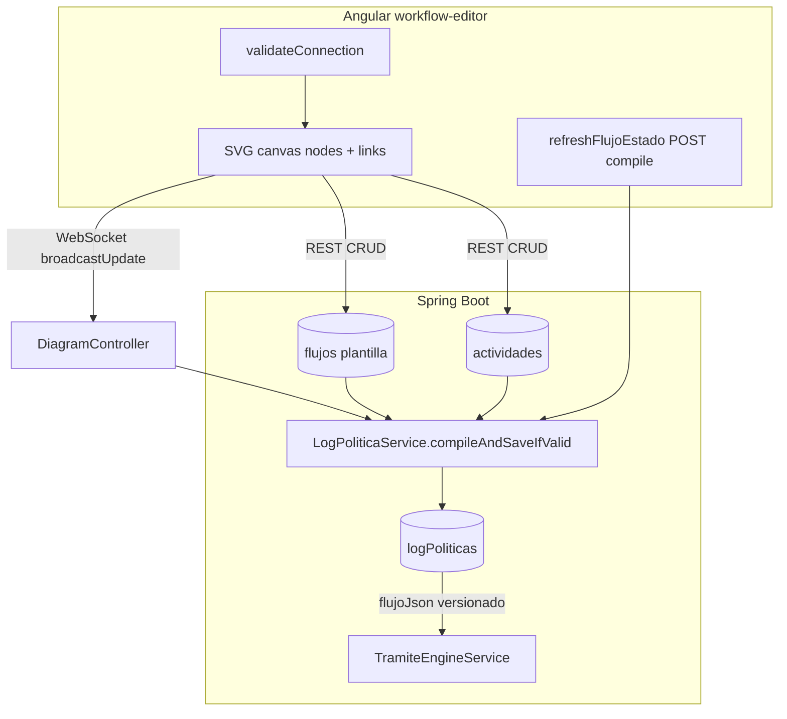
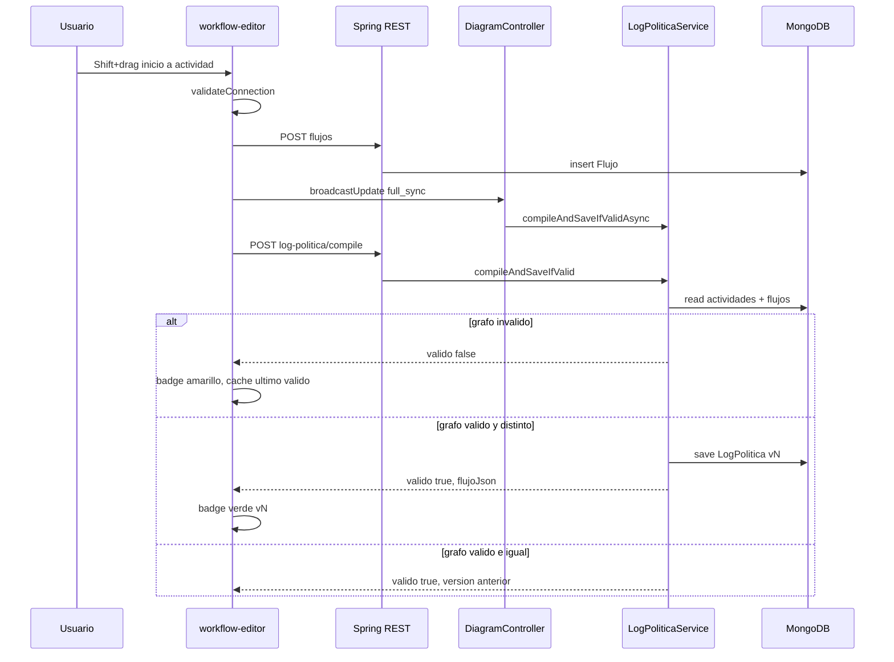

# Lógica técnica del diagrama de workflow (Política de Negocio)

Documento de referencia para continuar desarrollo en Cursor u otros chats. Describe cómo funciona el **editor de diagramas**, la **persistencia**, la **compilación del flujo** y su relación con la **ejecución de trámites**.

---

## 1. Visión general

El sistema separa tres capas de datos:

| Capa | Qué representa | Dónde vive | Cuándo cambia |
|------|------------------|------------|---------------|
| **Canvas (diseño)** | Nodos visuales + flechas del editor | MongoDB: `actividades` + `flujos` (plantilla, `portafolioId = null`) | Al crear/mover/conectar/eliminar en el editor |
| **Flujo compilado (`flujoJson`)** | Snapshot ejecutable validado Inicio→Fin | MongoDB: `logPoliticas` | Solo cuando la compilación pasa todas las reglas |
| **Instancia de trámite** | Copia del flujo para un portafolio concreto | MongoDB: `flujos` con `portafolioId` | Al crear un trámite (`PortafolioService`) |



**Idea clave:** dibujar un nodo o una flecha **no** equivale automáticamente a generar una nueva versión de código. El "código" es el `flujoJson` en `LogPolitica`, y solo se versiona cuando el grafo es **válido** (reglas Inicio→Fin) y **semánticamente distinto** al último válido.

---

## 2. Componentes y rutas de código

### Backend (`politica-negocio/`)

| Archivo | Rol |
|---------|-----|
| `model/Actividad.java` | Nodo del diagrama (tipo, posición, departamento/pool, estado JSON) |
| `model/Flujo.java` | Arista persistida: `actividadId` origen + `proceso` con destinos |
| `model/LogPolitica.java` | Versión compilada: `flujoJson`, `version`, `valido`, `funcional` |
| `service/LogPoliticaService.java` | Validación + compilación + deduplicación de versiones |
| `controller/LogPoliticaController.java` | REST: compile, getUltimo, historial |
| `controller/DiagramController.java` | WebSocket STOMP: colaboración + compile async |
| `service/TramiteEngineService.java` | Avance del trámite según tipo de nodo (decisión, pregunta) |
| `service/PortafolioService.java` | Clona plantillas de flujo al crear trámite |
| `test/.../LogPoliticaServiceTest.java` | Tests de reglas de compilación |

### Frontend (`politica-negocio-frontend/`)

| Archivo | Rol |
|---------|-----|
| `components/workflow-editor/workflow-editor.component.ts` | Editor SVG, validación al conectar, badge, modal |
| `components/workflow-editor/workflow-editor.component.html` | UI: toolbar, canvas, badge clickeable, modal JSON |
| `core/services/log-politica.service.ts` | Cliente HTTP para compile / getUltimo / historial |
| `features/politica_negocio/services/diagram.service.ts` | WebSocket STOMP (SockJS) colaboración |

**Ruta Angular:** `/politicas/diagrama/:id` → `WorkflowEditorComponent`

---

## 3. Modelo de datos

### 3.1 Actividad (nodo)

Colección MongoDB: `actividades`

```java
// Campos relevantes para el diagrama
politicaId, departamentoId, nombre, tipoNodo,
ejeX, ejeY, width, height, estado
```

**`tipoNodo` en BD vs UI:**

| UI (`workflow-editor`) | Persistido en BD (`tipoNodo`) | Normalizado en compilador |
|------------------------|-------------------------------|---------------------------|
| `inicio` | `inicio` | `inicio` |
| `actividad` | `actividad` | `actividad` |
| `decision` | `decision` | `decision` |
| `pregunta` | `while_do` | `pregunta` |
| `fin` | `fin` | `fin` |

**`estado` como JSON** (string) para nodos especiales:

- **pregunta:** `{ "iterativoTipo": "while_do"|"do_while", "condicion": "...", "retornoActividadId": "..." }`
- **decision:** `{ "condicion": "..." }`
- **structured_activity / datastore:** otros metadatos visuales

El **pool (swimlane)** es `departamentoId`. Al arrastrar un nodo entre lanes se actualiza y puede disparar nueva versión compilada.

### 3.2 Flujo (arista / plantilla)

Colección MongoDB: `flujos`

- **Plantilla de política:** `portafolioId == null`
- **Instancia de trámite:** `portafolioId` = id del portafolio

**Importante:** cada conexión dibujada crea un **documento Flujo separado** con un solo destino en `proceso.siguientes[0]`. El compilador agrega todas las aristas salientes de un mismo `actividadId` en un índice `outgoingBySource`.

```json
{
  "tipo": "secuencial|alternativo|iterativo_while|paralelo",
  "siguientes": [{ "actividadDestinoId": "...", "label": "Sí", "condicion": "..." }],
  "estadoActual": "pendiente",
  "orden": 1
}
```

### 3.3 LogPolitica (flujo compilado)

Colección MongoDB: `logPoliticas`

| Campo | Significado |
|-------|-------------|
| `version` | Entero incremental por cada compilación válida **nueva** |
| `valido` | `true` si pasó validación al compilar |
| `funcional` | `true` = versión activa; `false` = reemplazada o invalidada |
| `flujoJson` | Snapshot estructurado del flujo ejecutable |
| `mensajeValidacion` | Motivo si dejó de ser funcional o error |

**Política de versiones:**

- Compilación **inválida** → no guarda registro nuevo; la versión funcional anterior **se mantiene**.
- Compilación **válida** pero `flujoJson` **igual** al último válido → no crea versión nueva (ej. solo mover X/Y).
- Compilación **válida** con cambio de `departamentoId` u otra diferencia semántica → **sí** crea versión nueva y desactiva la anterior.

---

## 4. Flujo del editor (frontend)

### 4.1 Carga inicial

En `ngOnInit`:

1. `loadPolitica`, `loadDepartamentos`, `loadFormularios`
2. `loadActividades` → mapea a `nodes` signal
3. `loadFlujos` → mapea a `links` signal (un link por documento Flujo)
4. `loadFlujoEstado` → GET último `LogPolitica` funcional
5. WebSocket: `diagramService.connectToDiagram(politicaId)`

### 4.2 Añadir nodo (`addNode`)

1. Crea `WorkflowNode` en memoria con `tempId`
2. POST `Actividad` → asigna `id` real
3. `broadcastUpdate()` vía WebSocket (`full_sync` con nodes + links)

**No genera versión compilada** por sí solo si el grafo aún no es válido.

### 4.3 Conectar nodos (`endConnection`)

**Gesto:** `Shift + arrastrar` desde nodo origen → soltar sobre destino.

Secuencia:

1. `validateConnection(source, target)` — reglas en frontend (ver §6)
2. `computeLinkTipo(source)` — tipo de arista
3. `computeLinkLabel` — Sí/No para decisión
4. Añade link en memoria
5. Si ambos nodos tienen `id`: POST `Flujo` (un documento por arista)
6. `persistPreguntaRetornoAfterConnection` si destino es `pregunta`
7. `broadcastUpdate()` + `refreshFlujoEstado()` (debounce 400ms → POST compile)

### 4.4 Tipos de enlace automáticos (`computeLinkTipo`)

| Origen | Condición | `proceso.tipo` |
|--------|-----------|----------------|
| `decision` | siempre | `alternativo` |
| `pregunta` | siempre | `iterativo_while` |
| otros | 0 aristas salientes previas | `secuencial` |
| otros | ≥1 arista saliente previa | `paralelo` |

Etiquetas decisión: primera rama `Sí`, segunda `No`.

### 4.5 Mover nodo / cambiar pool

- Drag actualiza `ejeX`, `ejeY` y detecta lane → `departamentoId`
- Al soltar: PUT `Actividad`
- Si cambió `departamentoId`: `refreshFlujoEstado()` (puede generar nueva versión compilada)

### 4.6 Eliminar

- Nodo: soft-delete `Actividad` + quita links locales + `refreshFlujoEstado`
- Link: soft-delete `Flujo` + `refreshFlujoEstado`
- Si el grafo queda inválido, compile falla pero **último LogPolitica funcional permanece**

### 4.7 Colaboración WebSocket

| Acción cliente | Destino STOMP | Efecto servidor |
|----------------|---------------|-----------------|
| `sendDiagramUpdate` | `/app/diagram/update/{politicaId}` | Guarda `LogDiagrama`, compile async, broadcast `/topic/diagram/{politicaId}` |
| `sendCursorPosition` | `/app/diagram/cursor/{politicaId}` | Broadcast cursores |

Endpoint SockJS: `http://localhost:8081/ws-diagram`

---

## 5. Compilación (`LogPoliticaService`)

### 5.1 Entrada

`compileAndSaveIfValid(politicaId)`:

1. Carga `actividades` y `flujos` plantilla (`findPlantillasByPoliticaId`)
2. Construye `outgoingBySource` (índice origen → lista de aristas)
3. Valida precondiciones y grafo (`validateFlow`)
4. Si inválido → `LogPoliticaCompileResult { valido: false, mensaje }` **sin guardar**
5. Si válido → `buildFlujoJson`, compara con último válido, guarda o reutiliza versión

### 5.2 Reglas de validación (`validateFlow`)

**Precondiciones:**

- Exactamente **un** nodo `inicio`
- Al menos **un** nodo `fin`
- Desde `inicio` debe alcanzarse algún `fin`

**Por cada nodo alcanzable desde inicio (excepto `fin`):**

- Debe tener al menos una salida
- Debe existir camino eventual hacia `fin` (recorrido inverso desde nodos `fin`)

**Decisión (`decision`):**

- Exactamente **2** salidas
- Cada rama con `label` (Sí/No)
- **No** ambas ramas pueden apuntar a `fin`
- Cada rama debe terminar en `fin` (directo o vía actividades)

**Paralelo (`actividad` o `inicio` con ≥2 salidas):**

- Ninguna rama puede ir directo a `fin`

**Pregunta (`pregunta` / `while_do` / `do_while`):**

- `iterativoTipo` debe ser `while_do` o `do_while`
- Al menos una salida debe llegar a `fin` (permite ciclo + salida)

**Ciclos:**

- Ciclos en el grafo solo permitidos si el ciclo incluye al menos un nodo `pregunta`
- Si hay ciclo sin `pregunta` → error: *"Para volver a una actividad anterior use un nodo Pregunta (while/do-while)"*

**Nodos huérfanos** (sin conexión desde inicio): ignorados en `flujoJson`; no invalidan si el subgrafo conectado es correcto.

### 5.3 Deduplicación de versión

Antes de guardar:

```java
if (getUltimoValido().flujoJson ≈ nuevo flujoJson) // ignora campo version
  return versión anterior sin save;
```

Comparación: `flujoJsonSemanticallyEqual` — nodos ordenados por `nodoId`, sin campo `version`.

**Cambia versión cuando:** estructura de aristas, tipos, formularios, `departamentoId`, condiciones, etc.

**No cambia versión cuando:** solo coordenadas X/Y en canvas (si el JSON compilado resultante es idéntico).

### 5.4 Estructura de `flujoJson`

```json
{
  "politicaId": "...",
  "version": 2,
  "valido": true,
  "inicioNodoId": "id-inicio",
  "nodos": [
    {
      "nodoId": "...",
      "tipo": "inicio|actividad|decision|pregunta|fin",
      "departamentoId": "...",
      "nombre": "...",
      "formularioId": "...",
      "condicion": "...",
      "iterativoTipo": "while_do",
      "retornoActividadId": "...",
      "siguiente": {
        "flujoTipo": "secuencial|alternativo|iterativo|paralelo",
        "destinos": [
          { "nodoId": "...", "label": "Sí", "condicion": "..." }
        ]
      }
    }
  ]
}
```

Solo incluye nodos **alcanzables desde inicio**.

**`inferFlujoTipo` en compilador:**

- `decision` → `alternativo`
- `pregunta` → `iterativo`
- ≥2 salidas → `paralelo`
- else → `secuencial`

**`retornoActividadId` (pregunta):**

- Tomado de `Actividad.estado` si existe
- Si no, inferido: predecesor actividad que no es entrada al cuerpo del bucle
- El editor persiste al conectar `actividad → pregunta`

---

## 6. Validación en canvas (frontend)

`validateConnection` en `workflow-editor.component.ts` — se ejecuta **antes** de persistir la arista.

| Regla | Mensaje / comportamiento |
|-------|--------------------------|
| Auto-loop | "No se puede conectar un nodo consigo mismo" |
| Duplicado | "Ya existe una conexión entre estos nodos" |
| Decisión >2 salidas | "La decisión solo puede tener exactamente 2 conexiones" |
| Decisión destino inválido | Solo `actividad` o `fin` |
| Decisión fin/fin | "La decisión no puede tener ambas ramas hacia Fin" |
| Paralelo → fin | "En conexión paralela no se puede conectar directamente a Fin" |
| Paralelo entre actividades | 2ª+ salida desde `actividad` solo hacia `actividad` |
| Ciclo sin pregunta | "Para volver a una actividad anterior use un nodo Pregunta..." |

El backend repite y refuerza estas reglas en `validateFlow`; el frontend da feedback inmediato.

---

## 7. UI: badge y modal de flujo compilado

### Signals de estado

```typescript
flujoValido, flujoVersion, flujoMensaje, flujoJson,
ultimoFlujoValidoJson, ultimoFlujoValidoVersion,
showFlujoModal, modalFlujoJson, modalFlujoVersion, modalEsIncompleto
```

### Refresco automático

`refreshFlujoEstado()` — debounce **400ms**:

- POST `/api/politicas/{id}/log-politica/compile`
- `applyCompileResult` actualiza badge sin pulsar Guardar

Se dispara tras: conectar, eliminar nodo/link, cambiar pool, cambiar propiedades, sync remoto WebSocket.

### Badge (header)

| Estado | Apariencia | Clic |
|--------|------------|------|
| `flujoValido === true` | Verde "Flujo válido vN" | Modal con `flujoJson` actual |
| `flujoValido === false` | Amarillo "Flujo incompleto" | Modal con error + último JSON válido si existe |
| `null` | Sin badge | — |

### Modal

- `<pre>` con JSON formateado
- Botones: Copiar JSON, Cerrar
- Patrón overlay: `.wf-form-overlay` (mismo estilo que modal de formulario)

---

## 8. API REST

Base: `http://localhost:8081/api/politicas/{politicaId}`

| Método | Ruta | Descripción |
|--------|------|-------------|
| POST | `/log-politica/compile` | Compila; guarda si válido y distinto |
| GET | `/log-politica` | Último `LogPolitica` con `valido=true` y `funcional=true` |
| GET | `/log-politica/historial` | Todas las versiones |

**Actividades y flujos** (CRUD estándar bajo `/api/politicas/{id}/actividades` y `/flujos`) — usados por el editor para persistir canvas.

---

## 9. Relación con ejecución de trámites

### Crear trámite

`PortafolioService` clona flujos plantilla (`portafolioId = null`) a instancias con `portafolioId` del nuevo portafolio.

Requiere `LogPolitica` funcional válido para la política (flujo diseñado correctamente).

### Avanzar trámite

`TramiteEngineService.resolveDestinos`:

| Tipo nodo | Comportamiento |
|-----------|----------------|
| `decision` | Requiere `decisionLabel` ("Sí"/"No"); filtra aristas por label |
| `pregunta` | Si `continuarIteracion=true` → va a `retornoActividadId` del estado; si no → sigue salidas normales (salida del bucle) |
| otros | Todas las aristas salientes del nodo |

El motor usa instancias `Flujo` del portafolio, no el `flujoJson` directamente en runtime; el `flujoJson` es el **contrato de diseño** versionado.

---

## 10. Diagrama de secuencia: conectar dos nodos



---

## 11. Casos de uso frecuentes

### Solo añadir Inicio

- Compile: inválido (falta fin / conexiones)
- No se crea `LogPolitica`
- Badge: incompleto o sin compilado

### Inicio → Actividad (sin Fin)

- Inválido hasta conectar cadena completa a `fin`

### Inicio → Actividad → Fin

- Primera compilación válida → **v1**
- Badge verde; clic muestra JSON

### Añadir actividad suelta con v1 ya existente

- Si no está conectada desde inicio: compile sigue válido con mismo grafo alcanzable
- **No** crea v2 (deduplicación)

### Romper una conexión

- Compile inválido
- **v1 sigue funcional** en BD
- Modal incompleto muestra error + JSON de v1

### Mover actividad a otro pool (departamento)

- Cambia `departamentoId` en `flujoJson`
- Compile válido → **nueva versión**

### Decisión con dos ramas (una a fin, otra a actividad→fin)

- Válido (test `compile_decisionRamaFinYRamaActividades_esValido`)

### Bucle con pregunta

- Ejemplo válido: `inicio → pregunta → cuerpo → pregunta` + `pregunta → fin`
- Ciclo sin nodo `pregunta`: rechazado en FE y BE

---

## 12. Tests de referencia

`LogPoliticaServiceTest` cubre:

- `compile_inicioActividadFin_creaVersionValida`
- `compile_agregarActividadIntermedia_creaNuevaVersion`
- `compile_sinFin_noInvalidaVersionAnterior`
- `compile_decisionRamaFinYRamaActividades_esValido`
- `compile_decisionAmbasRamasFin_esInvalido`
- `compile_paraleloConRamaFin_esInvalido`
- `compile_cicloSinPregunta_esInvalido`
- `compile_preguntaConCicloYSalidaAFin_esValido`
- `compile_mismoGrafoSinCambioPool_noCreaNuevaVersion`
- `compile_cambioDepartamentoNodo_siCreaNuevaVersion`

Ejecutar:

```bash
cd politica-negocio
./mvnw.cmd test -Dtest=LogPoliticaServiceTest
```

---

## 13. Nodos de interés para el flujo de negocio

Para **compilación y trámites** los tipos relevantes son:

- `inicio`, `actividad`, `decision`, `pregunta` (while/do-while), `fin`

Otros tipos en el toolbar (send, receive, region, fork, comment, etc.) son **visuales** o legacy; el compilador los trata según `normalizeStoredTipo` y pueden no participar en un flujo ejecutable estándar.

---

## 14. Puntos de extensión habituales

| Necesidad | Dónde tocar |
|-----------|-------------|
| Nueva regla de validación | `validateConnection` (FE) + `validateFlow` (BE) + test |
| Cambiar formato `flujoJson` | `buildFlujoJson` + consumidores (`TramiteEngineService`) |
| Nuevo disparador de compile | Llamar `refreshFlujoEstado()` tras el cambio |
| Historial de versiones en UI | `GET /log-politica/historial` (ya existe) |
| Notificación sin alert | Reemplazar `showConnectionError` / alerts en `saveDiagram` |

---

## 15. Variables de entorno / puertos

| Servicio | URL |
|----------|-----|
| Backend Spring | `http://localhost:8081` |
| WebSocket diagrama | `http://localhost:8081/ws-diagram` |
| Angular editor | `http://localhost:4200` |
| MongoDB | `mongodb://localhost:27017/politica_db` |

---

*Última actualización: refleja implementación con validación en canvas, modal de flujo compilado, deduplicación pool_only y reglas decisión/paralelo/ciclos.*
