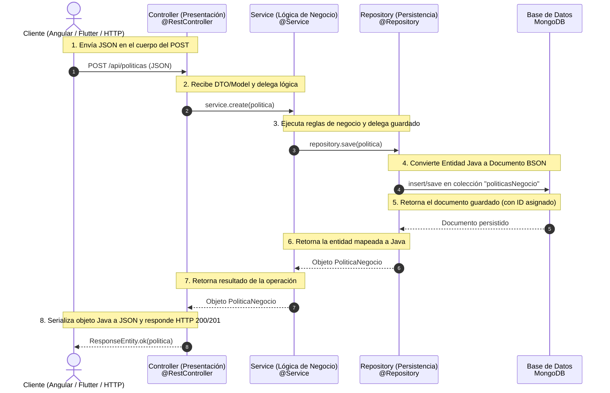

# Flujo de Arquitectura y Flujo de Datos (Spring Boot ↔ MongoDB)

Este documento explica cómo fluye la información en el proyecto **politica-negocio** desde la recepción de una petición HTTP hasta la persistencia en **MongoDB**, cómo se interconectan los componentes y cómo se utiliza la **Inyección de Dependencias** en Spring Boot.

---

## 1. Diagrama del Flujo de Datos (Mermaid)

El siguiente diagrama ilustra el camino de ida y vuelta para una operación típica, como la creación de una Política de Negocio (`POST /api/politicas`):



---

## 2. Capas de la Arquitectura

El backend está diseñado siguiendo el patrón clásico de **Arquitectura Multicapa**:

### A. Capa de Modelo (`model/`)
Define la estructura de los datos que se van a persistir.
* **Anotación Clave**: `@Document(collection = "politicasNegocio")`
* Indica a Spring Data MongoDB que esta clase representa un documento dentro de una colección física llamada `politicasNegocio`.
* Ejemplo: [PoliticaNegocio.java](file:///c:/EDBERTO/ULT%20SEMESTRE/SW1/1ER%20parcial/SW1_PN_1_2026/politica-negocio/src/main/java/com/example/politica_negocio/model/PoliticaNegocio.java) extiende de `BaseEntity` y posee campos como `id`, `nombre` y `descripcion`.

### B. Capa de Acceso a Datos (`repository/`)
Maneja las operaciones de lectura y escritura en la base de datos sin requerir consultas manuales.
* **Anotación Clave**: `@Repository`
* Las interfaces extienden de `MongoRepository<T, ID>`. Esta interfaz de Spring proporciona métodos listos para usar como `save()`, `findById()`, `findAll()`, `deleteById()`, etc.
* Ejemplo: [PoliticaNegocioRepository.java](file:///c:/EDBERTO/ULT%20SEMESTRE/SW1/1ER%20parcial/SW1_PN_1_2026/politica-negocio/src/main/java/com/example/politica_negocio/repository/PoliticaNegocioRepository.java).

### C. Capa de Negocio (`service/`)
Contiene las reglas de negocio, validaciones, logs y orquestación de operaciones. Es el "cerebro" de la aplicación.
* **Anotación Clave**: `@Service`
* Es donde se centraliza la lógica compleja. Por ejemplo, al crear una política, el servicio también inicializa el JSON del diagrama, crea logs y asocia al usuario actual.
* Ejemplo: [PoliticaNegocioService.java](file:///c:/EDBERTO/ULT%20SEMESTRE/SW1/1ER%20parcial/SW1_PN_1_2026/politica-negocio/src/main/java/com/example/politica_negocio/service/PoliticaNegocioService.java).

### D. Capa de Presentación / API (`controller/`)
Expone endpoints REST HTTP para que clientes externos (como la app Angular o Flutter) interactúen con el sistema.
* **Anotaciones Claves**: `@RestController`, `@RequestMapping("/api/politicas")`
* Se encarga de mapear las URLs y métodos HTTP (`GET`, `POST`, `PUT`, `DELETE`) a funciones en Java, y de manejar las respuestas HTTP (`ResponseEntity`).
* Ejemplo: [PoliticaNegocioController.java](file:///c:/EDBERTO/ULT%20SEMESTRE/SW1/1ER%20parcial/SW1_PN_1_2026/politica-negocio/src/main/java/com/example/politica_negocio/controller/PoliticaNegocioController.java).

---

## 3. ¿Cómo se Interconectan y se Instancian? (Inyección de Dependencias)

Uno de los mayores interrogantes en Spring Boot es: *¿quién crea los objetos (instancias) y cómo se conocen entre sí sin hacer un `new` manual?*

La respuesta es el **ApplicationContext** de Spring y el contenedor de **Inyección de Dependencias (DI)**.

### El Ciclo de Vida y los Beans
1. Al arrancar la aplicación (`PoliticaNegocioApplication`), Spring escanea todos los archivos del proyecto buscando clases anotadas con `@Component`, `@RestController`, `@Service`, o `@Repository`.
2. Al encontrarlas, Spring **crea una única instancia de cada una** (llamadas *Beans* en el ámbito de Spring) y las almacena en memoria.
3. Si un componente necesita a otro, Spring se lo suministra automáticamente al momento de construirlo.

### Inyección de Dependencias por Constructor (Lombok `@RequiredArgsConstructor`)
En lugar de escribir constructores gigantes o usar la anotación antigua `@Autowired` sobre las variables, este proyecto utiliza la inyección recomendada por constructor usando **Lombok**.

Tomemos como ejemplo la relación entre **Controller** y **Service**:

```java
@RestController
@RequestMapping("/api/politicas")
@RequiredArgsConstructor // <-- Genera el constructor con argumentos para todos los atributos "final"
public class PoliticaNegocioController {
    // Al ser "final", Spring sabe que debe resolver este Bean al construir el Controller
    private final PoliticaNegocioService service; 
}
```

Tras bambalinas, Lombok compila la clase generando el siguiente constructor real:

```java
public PoliticaNegocioController(PoliticaNegocioService service) {
    this.service = service;
}
```

Cuando Spring Boot inicializa la aplicación, realiza las siguientes tareas en orden:
1. Instancia el driver de conexión de MongoDB.
2. Instancia los proxies dinámicos para los **Repositories** (ej: `PoliticaNegocioRepository`).
3. Instancia los **Services** (ej: `PoliticaNegocioService`), pasándole en su constructor el repositorio previamente instanciado.
4. Instancia los **Controllers** (ej: `PoliticaNegocioController`), pasándole en su constructor el servicio ya listo.

De esta forma, **todos los componentes quedan conectados automáticamente como Singletons**, listos para recibir peticiones sin sobrecargar la memoria.

---

## 4. Detalle del Flujo de Ida y Vuelta

Siguiendo el ejemplo de creación de una política:

1. **El Cliente** envía una petición HTTP `POST` a `/api/politicas` con un cuerpo JSON:
   ```json
   {
     "nombre": "Seguridad de Datos",
     "descripcion": "Políticas sobre el resguardo de contraseñas."
   }
   ```
2. **Spring Boot (Capa de Entrada)** recibe la petición, lee el JSON y, gracias a la anotación `@RequestBody PoliticaNegocio politica` en el Controller, deserializa automáticamente ese JSON a un objeto Java de clase `PoliticaNegocio`.
3. **El Controller** llama a `service.create(politica)`.
4. **El Service** realiza tareas complementarias:
   * Asigna la fecha actual: `politica.setCreatedAt(LocalDateTime.now())`.
   * Llama al repositorio para guardar la entidad: `repository.save(politica)`.
   * Registra el diagrama inicial en `logDiagramaRepository` y asocia el log en `adminDiagramaRepository`.
5. **El Repository** (Spring Data MongoDB) se comunica con MongoDB a través del driver. Transforma el objeto Java a formato **BSON** (JSON binario) y lo envía a la base de datos.
6. **MongoDB** guarda el registro en el disco físico, le genera una clave única (`_id`) y retorna el éxito de la operación.
7. **El Repository** recibe la respuesta, mapea el campo `_id` de MongoDB al atributo `id` (String) de nuestro objeto Java y lo retorna al Service.
8. **El Service** finaliza su lógica y devuelve el objeto resultante al Controller.
9. **El Controller** retorna `ResponseEntity.ok(saved)`, lo que indica a Spring Boot escribir una respuesta HTTP con código de estado `200 OK` y el objeto serializado de vuelta a JSON para el cliente.
